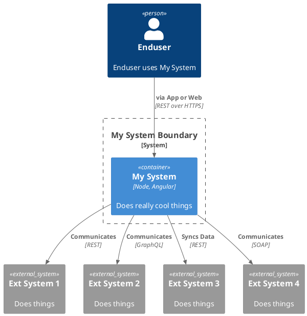
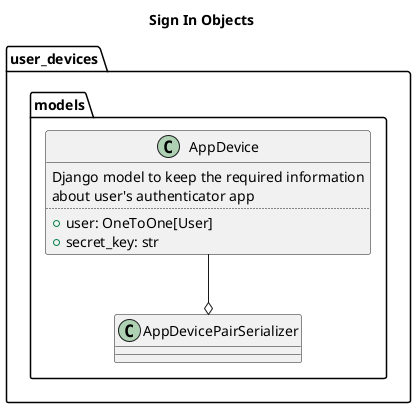

# Dark Mode Demo

<div class="grid cards" markdown>

-   :fontawesome-solid-user:{ .lg .middle .mkdocspref } __Mkdocs Preference__

    ---

    DARK|LIGHT
    
    The mkdocs preference for light/dark.

    `(data-md-color-media)`

    


-   :material-web:{ .lg .middle .systempref } __System Preference__

    ---

    DARK|LIGHT

    The system preference for light/dark.

    `(prefers-color-scheme)`


</div>


## Example



Text under diagram.

## The second diagram



## This is the third diagram using custom keyword

```plantuml
@startuml
skinparam backgroundColor transparent
A -> B
@enduml
```



And here is just code

```python
print("Hello world")
```
